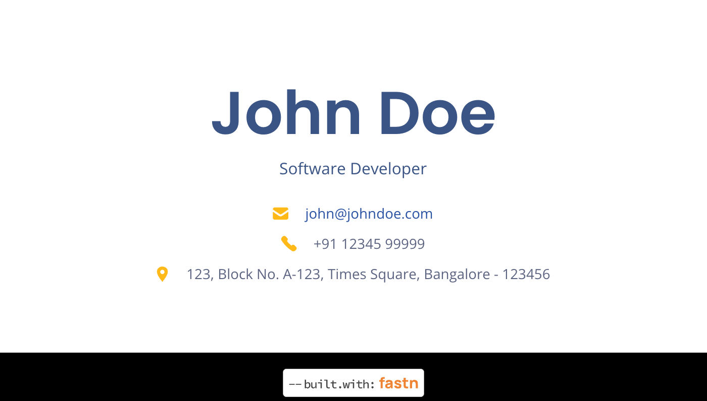
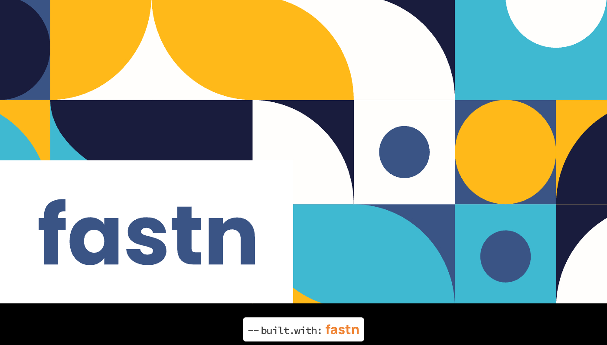

# Pattern Business Card

fastn-community.github.io/pattern-business-card is a fastn business card
component which contains front and back UI of a business card. Sunset business
card can be used on your fastn web projects.

# Preview

## Pattern Business Card Front:

## Pattern Business Card Back:

# Get Rolling

[Click here](https://fastn-community.github.io/pattern-business-card/) to learn how to use this package.

# [Dive into the Docs](https://fastn-community.github.io/pattern-business-card/)

# [Changelog](Changelog.md)

# fastn and Curious?

Discover more of fastn here.

- [Expander Crash Course](https://fastn.com/expander/)
- [Video Tutorials](https://fastn.com/expander/hello-world/-/build/)
- [Explore more Templates/ Components/ Package](https://fastn.com/featured/)

# Become a fastn Contributor

Here's your roadmap:

1.  Finish the [Expander Crash Course](https://fastn.com/expander/)
2.  Share your progress and ideas on [Discord](https://discord.gg/bucrdvptYd).
3.  Let our team guide you on your contributor journey.

## Become a fastn-trailblazer

- [Join our Discord Server](https://discord.gg/bucrdvptYd) to connect with other fastn enthusiasts and stay up to date with the latest developments.
- [Star us on GitHub](https://github.com/fastn-stack/fastn/)

## License - [Open Source BSD](https://github.com/fastn-community/sunset-business-card/blob/main/LICENSE)
